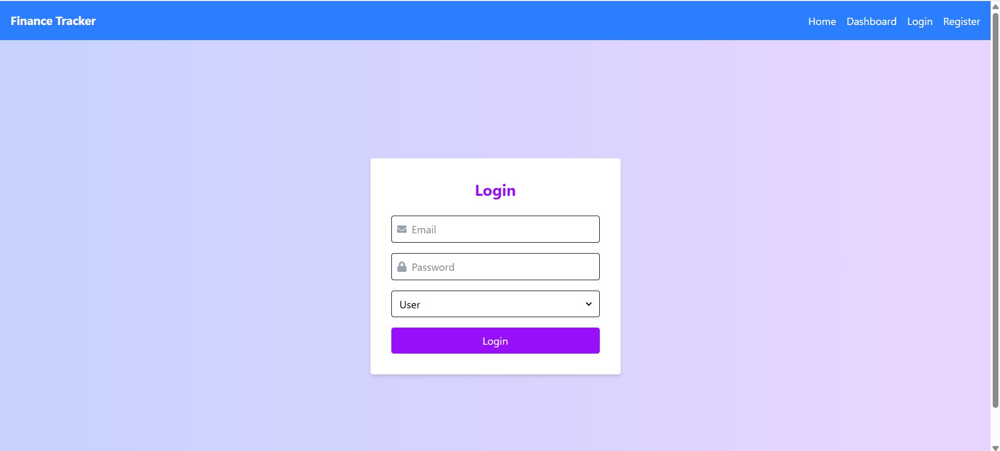
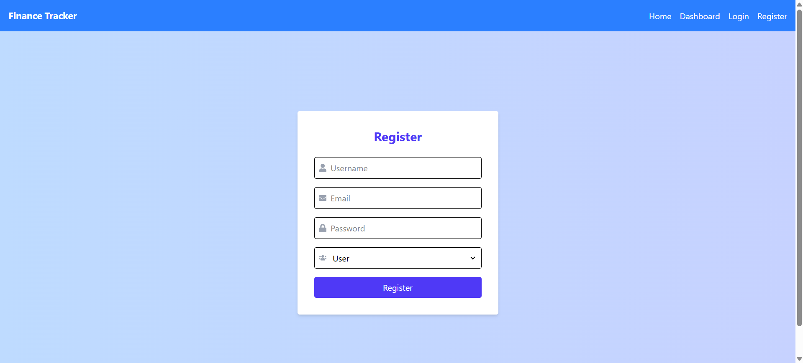
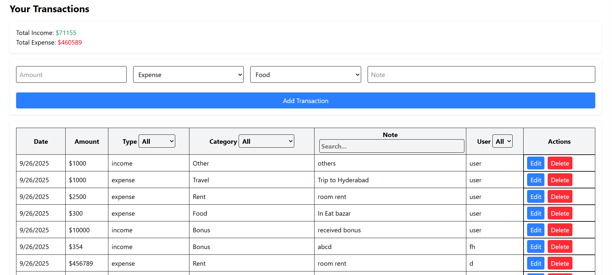
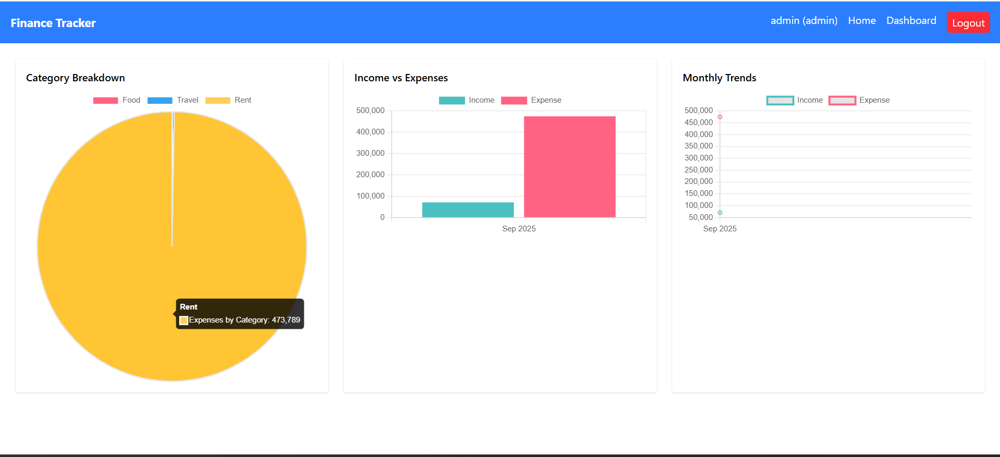

# 📘 Finance Tracker  

A full-stack **Finance Tracker** application built with **MERN (MongoDB, Express, React, Node.js)**.  
It helps users track income, expenses, and view analytics with interactive charts (Pie, Bar, Line).  

---

## 🚀 Features  
- 🔐 User authentication (JWT-based login/signup)  
- ➕ Add, edit, and delete transactions  
- 📊 Analytics dashboard with:  
  - Category Breakdown (Pie Chart)  
  - Income vs Expenses (Bar Chart)  
  - Monthly Trends (Line Chart)  
- ⚡ Redis caching for faster analytics  
- 🎨 Clean UI built with React + TailwindCSS  

---

## 🖼️ Screenshots  

### 🔑 Login Page  
  

### 🔑 Register Page  
  

### 🏠 Dashboard  
  

### 📊 Analytics  
  

---

## 🛠️ Tech Stack  

- **Frontend:** React, TailwindCSS, Chart.js  
- **Backend:** Node.js, Express.js, MongoDB, Redis  
- **Auth:** JWT (JSON Web Tokens)  
- **Database:** MongoDB (Mongoose ORM)  
- **Caching:** Redis  

---

## ⚙️ Installation & Setup  

### 1️⃣ Clone the repository  
```bash
git clone https://github.com/your-username/finance-tracker.git
cd finance-tracker
```

---

### 2️⃣ Backend Setup  
```bash
cd backend
npm install
```

Create a `.env` file in `/backend` with the following:  
```env
PORT=5000
MONGO_URI=mongodb://127.0.0.1:27017/finance_tracker
JWT_SECRET=your_jwt_secret
REDIS_URL=redis://localhost:6379
```

Run backend:  
```bash
npm run dev
```
(Uses **nodemon** for auto-restart)  

---

### 3️⃣ Frontend Setup  
```bash
cd frontend
npm install
npm run dev
```

The frontend will run at:  
👉 http://localhost:5173 (if using Vite)  

---

### 4️⃣ Redis Setup  
Make sure Redis is installed and running:  
```bash
redis-server
```

---

### 5️⃣ MongoDB Setup  
Make sure MongoDB is running locally:  
```bash
mongod
```

---

## ✅ Usage  
1. Register a new account.  
2. Login with your credentials.  
3. Add **Income** or **Expense** transactions.  
4. Go to **Dashboard** → View **Pie, Bar, Line** charts with analytics.  

---

## 📂 Project Structure  

```
finance-tracker/
│── backend/          # Express + MongoDB + Redis backend
│   ├── models/       # Mongoose models
│   ├── routes/       # Express routes (auth, transactions, analytics)
│   ├── middleware/   # Auth middleware
│   ├── server.js     # Entry point
│
│── frontend/         # React frontend
│   ├── src/
│   │   ├── pages/    # Pages (Dashboard, Login, Register, etc.)
│   │   ├── context/  # Auth context
│   │   ├── components/
│   │   └── App.jsx
│
│── screenshots/      # App screenshots for README
│── README.md
```

---

## 🧑‍💻 Contributing  
Pull requests are welcome!  
If you’d like to suggest a new feature, feel free to open an issue.  

---


